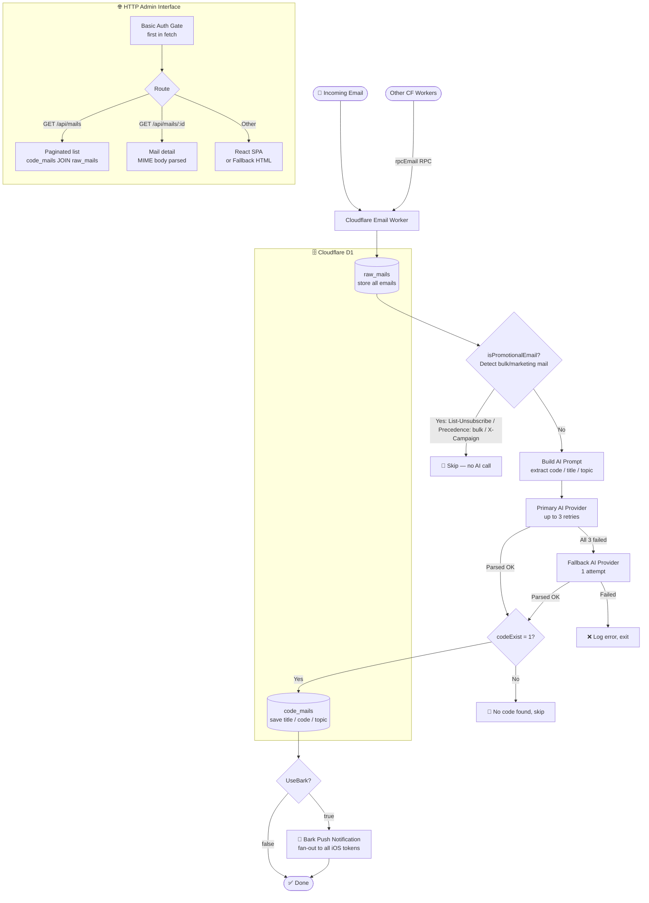

# Auth Inbox 📬

[English](https://github.com/TooonyChen/AuthInbox/blob/main/README.md) | [简体中文](https://github.com/TooonyChen/AuthInbox/blob/main/README_CN.md)

**Auth Inbox** is an open-source, self-hosted email verification code platform built on [Cloudflare](https://cloudflare.com/)'s free serverless services. It automatically processes incoming emails, filters out promotional mail before hitting the AI, extracts verification codes or links, and stores them in a database. A modern React dashboard lets administrators review extracted codes, inspect raw emails, and render HTML email previews — all protected by Basic Auth.

Don't want ads and spam in your main inbox? Need a bunch of alternative addresses for signups? Try this **secure**, **serverless**, **lightweight** service!

[](https://deploy.workers.cloudflare.com/?url=https://github.com/TooonyChen/AuthInbox)



---

## Table of Contents 📑

- [Features](#features-)
- [Technologies Used](#technologies-used-)
- [Installation](#installation-)
- [License](#license-)
- [Screenshots](#screenshots-)

---

## Features ✨

- **Promotional Filter**: Detects and skips bulk/marketing emails via headers (`List-Unsubscribe`, `Precedence: bulk`, etc.) before calling the AI — saves tokens.
- **AI Code Extraction**: Uses Google Gemini (with OpenAI as fallback) to extract verification codes, links, and organization names.
- **Modern Dashboard**: React 18 + shadcn/ui interface with mail list, detail panel, and three tabs — Extracted, Raw Email, Rendered HTML preview.
- **Safe HTML Preview**: Email HTML is sanitized with DOMPurify and rendered in a sandboxed iframe.
- **One-click Copy**: Verification codes and links have copy buttons with toast confirmation.
- **Real-Time Notifications**: Optionally sends Bark push notifications when new codes arrive.
- **Database**: Stores all raw emails and AI-extracted results in Cloudflare D1.

---

## Technologies Used 🛠️

- **Cloudflare Workers** — Serverless runtime for email handling and API.
- **Cloudflare D1** — SQLite-compatible serverless database.
- **Cloudflare Email Routing** — Routes incoming emails to the Worker.
- **React 18 + Vite + Tailwind CSS + shadcn/ui** — Frontend dashboard.
- **Any OpenAI-compatible / Anthropic AI provider** — Configurable via env vars; Gemini, OpenAI, DeepSeek, Groq, Anthropic, and more.
- **Bark API** — Optional iOS push notifications.
- **TypeScript** — End-to-end type safety.

---

## Installation ⚙️

### Prerequisites

- A [Google AI Studio API key](https://aistudio.google.com/)
- A domain bound to your [Cloudflare](https://dash.cloudflare.com/) account
- Cloudflare Account ID and API Token from [here](https://dash.cloudflare.com/profile/api-tokens)
- *(Optional)* [Bark App](https://bark.day.app/) for iOS push notifications

---

### Option 1 — Deploy via GitHub Actions

1. **Create D1 Database**

   Go to [Cloudflare Dashboard](https://dash.cloudflare.com/) → `Workers & Pages` → `D1 SQL Database` → `Create`. Name it `inbox-d1`.

   Open the database → `Console`, paste and run the contents of [`db/schema.sql`](https://github.com/TooonyChen/AuthInbox/blob/main/db/schema.sql).

   Copy the `database_id` for the next step.

2. **Fork & Deploy**

   [](https://deploy.workers.cloudflare.com/?url=https://github.com/TooonyChen/AuthInbox)

   In your forked repository, go to `Settings` → `Secrets and variables` → `Actions` and add:
   - `CLOUDFLARE_ACCOUNT_ID`
   - `CLOUDFLARE_API_TOKEN`
   - `TOML` — use the [comment-free template](https://github.com/TooonyChen/AuthInbox/blob/main/wrangler.toml.example.clear) to avoid parse errors.

   Then go to `Actions` → `Deploy Auth Inbox to Cloudflare Workers` → `Run workflow`.

   After success, **delete the workflow logs** to avoid leaking your config.

3. Jump to [Set Email Forwarding](#3-set-email-forwarding-).

---

### Option 2 — Deploy via CLI

1. **Clone and install**

   ```bash
   git clone https://github.com/TooonyChen/AuthInbox.git
   cd AuthInbox
   pnpm install
   ```

2. **Create D1 database**

   ```bash
   pnpm wrangler d1 create inbox-d1
   pnpm wrangler d1 execute inbox-d1 --remote --file=./db/schema.sql
   ```

   Copy the `database_id` from the output.

3. **Configure**

   ```bash
   cp wrangler.toml.example wrangler.toml
   ```

   Edit `wrangler.toml` — at minimum fill in:

   ```toml
   [vars]
   FrontEndAdminID       = "your-username"
   FrontEndAdminPassword = "your-password"
   UseBark               = "false"

   # AI provider — choose any compatible service
   AI_BASE_URL    = "https://generativelanguage.googleapis.com/v1beta/openai"
   AI_API_KEY     = "your-api-key"
   AI_API_FORMAT  = "openai"
   AI_MODEL       = "gemini-2.0-flash"

   [[d1_databases]]
   binding       = "DB"
   database_name = "inbox-d1"
   database_id   = "<your-database-id>"
   ```

   **`AI_API_FORMAT`** options:

   | Value | Endpoint | Compatible providers |
   |---|---|---|
   | `openai` | `/v1/chat/completions` | OpenAI, Gemini (OpenAI-compat), DeepSeek, Groq, Mistral, … |
   | `responses` | `/v1/responses` | OpenAI Responses API |
   | `anthropic` | `/v1/messages` | Anthropic Claude |

   **Common `AI_BASE_URL` values:**
   ```
   OpenAI:              https://api.openai.com
   Gemini (OAI-compat): https://generativelanguage.googleapis.com/v1beta/openai
   Anthropic:           https://api.anthropic.com
   DeepSeek:            https://api.deepseek.com
   Groq:                https://api.groq.com/openai
   ```

   **Optional fallback provider** (triggered if primary fails after 3 retries):
   ```toml
   # AI_FALLBACK_BASE_URL   = "https://api.openai.com"
   # AI_FALLBACK_API_KEY    = "your-fallback-key"
   # AI_FALLBACK_API_FORMAT = "openai"
   # AI_FALLBACK_MODEL      = "gpt-4o-mini"
   ```

   Optional Bark vars: `barkTokens`, `barkUrl`.

4. **Build and deploy**

   ```bash
   pnpm run deploy
   ```

   Output: `https://auth-inbox.<your-subdomain>.workers.dev`

---

### 3. Set Email Forwarding ✉️

Go to [Cloudflare Dashboard](https://dash.cloudflare.com/) → `Websites` → `<your-domain>` → `Email` → `Email Routing` → `Routing Rules`.

**Catch-all** (forwards all addresses to the Worker):


**Custom address** (forwards a specific address):


### 4. Done! 🎉

Visit your Worker URL, log in with the credentials you set, and start receiving verification emails.

---

## License 📜

[MIT License](LICENSE)

---

## Screenshots 📸


---

## Acknowledgements 🙏

- **Cloudflare Workers** for the serverless platform.
- **Google Gemini AI** for intelligent email extraction.
- **Bark** for real-time notifications.
- **shadcn/ui** for the component library.
- **Open Source Community** for the inspiration.

---

## TODO 📝

- [x] GitHub Actions deployment
- [x] OpenAI fallback support
- [x] React dashboard with shadcn/ui
- [x] Promotional email filter (skip ads before LLM)
- [x] Raw email viewer + sandboxed HTML preview
- [ ] Regex-based extraction as an AI-free option
- [ ] Multi-user support
- [ ] More notification methods (Slack, webhook, etc.)
- [ ] Sending email support
